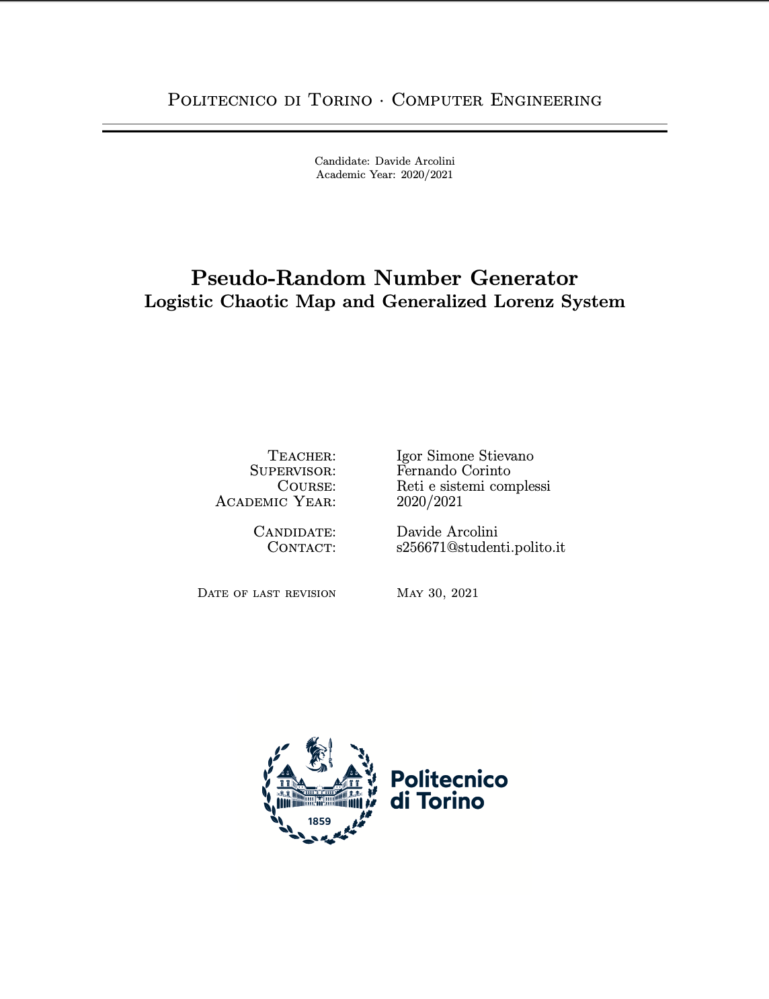

# Pseudo-Random Number Generator

## Logistic Chaotic Map and Generalized Lorenz System

#### CANDIDATE:   Davide Arcolini
#### SUPERVISOR:  Fernando Corinto
#### TEACHER:     Igor Simone Stievano
#### CONTACT:     s256671@studenti.polito.it

Pseudo-Random Number Generator algorithms used for the final essay of the elective course "Reti e sistemi complessi: fenomeni fisici e interazioni sociali".

The folder contains:
- **Middle-square method**: the algorithm used to reproduce the middle-square procedure for the generation of pseudo-random numbers proposed by **John von Neumann** in 1949
- **Lorenz System**: contains the algorithms used to reproduce the Lorenz System PRNG. In particular:
  - *lorenz.m*: MatLab implementation of the Lorenz system.
  - *lorenzSimulation.m*: MatLab implementation of the simulation of the Lorenz System.
  - *lyapunovExponent.m*: MatLab implementation of the computation of the Lyapunov exponent.
  - *PRNG_lorenzAlgorithm.m*: MatLab implementation of the PRNG algorithm.
- **Logistic Map**: contains the algorithms used to reproduce the Logistic Map PRNG. In particular:
  - *logisticEquation.m*: MatLab implementation of the Logistic equation.
  - *logisticMap.m*: MatLab implementation of the simulation of the Logistic Map.
  - *dynamicBehavior.m*: Plot of the dynamics of the Logistic Map.
  - *lyapunovExponent.m*: MatLab implementation of the computation of the Lyapunov exponent.
  - **PRNG_logisticAlgorithm**: contains the C algorithm used to implement the PRNG:
    * *myrandom.h*: library file that contains all the utilities for the algorithm.
    * *myrandom.c*: implementation of the utilities.
    * *PRNG_logistic.c*: C implementation of the algorithm.
    * *makefile*: makefile
